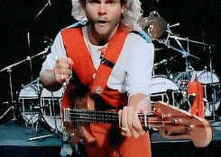

# 🦄🦄🦄

<br>
<br>
<br>

# PointerLockControls

- **PointerLockControls** is different since it uses the Pointer Lock API. That means the mouse is captured (the cursor is hidden during the capturing) and only mouse movements (so the actual delta values) transform the camera when looking around. This is the behavior you usually know from First-Person games.

<br>

##### Click on the image:

[](https://bruno-simon.com/)

> This amazing portfolio, is the kind of things you can do with Pointer Lock Controls.

<br>

# 👾👾👾 FIRST TEST 👾👾👾

### The Other day while looking for a solution for a "draco converter" issue, i fell upon this example, from the moment i saw it i feel like i should give it a try.

 <br>

[FirstPerson controls horizontal constraint](https://discourse.threejs.org/t/firstperson-controls-horizontal-constraint/17739)

<br>

- SO I STARTED to read the code and then I started to converted it to react.

<br>

- Most of it works, but of course there were some issues since i am still new with **REACT** itself.

<br>

[]()

<br>

#### SO IF YOU ARE ALREADY proficient in React, you can skip this part as its related to _doubts_ about "how to add an event".

###### (update) it worked!

#### (I was really tired when adding this, but i will keep it as ref)

> I TRIED TO ADD THE "BLOCKER" but it didn't work because I am trying to add an event listener to threejs "the scene" , it would have been easy to just have some div to make the connection to but for now i prefer to pass

- So this is the code that didnt work, it serves to add the overlay of the scene, where you explain the commands before playing

```javascript
this.blocker = document.getElementById("blocker");
this.instructions = document.getElementById("instructions");

this.instructions.addEventListener("click", (e) => {
  this.controls.lock();
});

this.controls.addEventListener("lock", (e) => {
  this.instructions.style.display = "none";
  this.blocker.style.display = "none";
});

this.controls.addEventListener("unlock", (e) => {
  this.blocker.style.display = "block";
  this.instructions.style.display = "";
});

this.scene.add(this.controls.getObject());
//
//
//
```

#### THE STYLES connected to it

```scss
//  THE STYLES connected to it
#blocker {
  position: absolute;
  width: 100%;
  height: 100%;
  background-color: rgba(0, 0, 0, 0.5);
}

#instructions {
  width: 100%;
  height: 100%;

  display: -webkit-box;
  display: -moz-box;
  display: box;

  -webkit-box-orient: horizontal;
  -moz-box-orient: horizontal;
  box-orient: horizontal;

  -webkit-box-pack: center;
  -moz-box-pack: center;
  box-pack: center;

  -webkit-box-align: center;
  -moz-box-align: center;
  box-align: center;

  color: #ffffff;
  text-align: center;
  font-family: Arial;
  font-size: 14px;
  line-height: 24px;

  cursor: pointer;
}
// https: ; //linguinecode.com/post/react-onclick-event-vs-js-addeventlistener
```

#### EXAMPLE of what i had in mind , but we cannot do it in this one

- I used this approach for the dropdown menu

[event listener react - dropdown GSAP menu](https://github.com/nadiamariduena/nadiamariduena-portfolio/blob/master/src/components/navbar/Navigation.js)

```javascript
class App extends React.Component {
  handleClick = () => console.log("Hi there");

  render() {
    return <button onClick={this.handleClick}>Say something</button>;
  }
}
```

<br>
<br>

# 👾👾👾👾

## LETS CONTINUE BUT BEFORE ...

### What is RAYCAST?

[](https://youtu.be/1IyH6NjaxFo)

- In a shooter game like counter strike, **when you shoot**, the **bullet** is no a gameObject travelling fast, but **is a "Ray" from the gun to N distance**. And every player in this ray get damaged.

> See the example above ( Jiban shooting some villain )
> [What is Raycast?](https://forum.unity.com/threads/what-is-raycast.400698/)

<br>
<br>

## LETS CONTINUE with the game commands (to see if it works)

<br>

```javascript
const onKeyDown = function (event) {
  switch (event.code) {
    case "ArrowUp":
    case "KeyW":
      moveForward = true;
      break;

    case "ArrowLeft":
    case "KeyA":
      moveLeft = true;
      break;

    case "ArrowDown":
    case "KeyS":
      moveBackward = true;
      break;

    case "ArrowRight":
    case "KeyD":
      moveRight = true;
      break;

    //  ---------
    //  JUMP
    //  ---------
    case "Space":
      if (canJump === true) velocity.y += 350;
      canJump = false;
      break;
  }
};

const onKeyUp = function (event) {
  switch (event.code) {
    case "ArrowUp":
    case "KeyW":
      moveForward = false;
      break;

    case "ArrowLeft":
    case "KeyA":
      moveLeft = false;
      break;

    case "ArrowDown":
    case "KeyS":
      moveBackward = false;
      break;

    case "ArrowRight":
    case "KeyD":
      moveRight = false;
      break;
  }
};
```

[](https://youtu.be/5EqWN4fT79s)

#### UNTIL NOW _no_ ERRORS just a WARNING

```javascript
  Line 117:7:  Expected a default case                default-case
  Line 149:7:  Expected a default case                default-case
  //
  117       switch (event.code) {
    149    switch (event.code) {
    //
    //
    //
  // READ MORE:
  // https://stackoverflow.com/questions/56084810/using-break-after-default-in-switch-statement-when-default-not-at-end
  //
// https://github.com/immerjs/immer/issues/91
```

[]()

<br>
<br>
<br>

# 🦏

## FLOOR GEOMETRY

- I think it s interesting to rediscover the uses of **Math random for geometries**

```javascript
// ---------------
// floor Geometry
// ---------------

this.floorGeometry = new THREE.PlaneGeometry(2000, 2000, 100, 100);
this.floorGeometry.rotateX(-Math.PI / 2);
//
//-------------------
// vertex displacement
//-------------------
//
let position = this.floorGeometry.attributes.position;
//
for (let i = 0, l = position.count; i < l; i++) {
  this.vertex.fromBufferAttribute(position, i);
  this.vertex.x += Math.random() * 20 - 10;
  this.vertex.y += Math.random() * 2;
  this.vertex.z += Math.random() * 20 - 10;
  position.setXYZ(i, this.vertex.x, this.vertex.y, this.vertex.z);
}
// ensure each face has unique vertices
this.floorGeometry = this.floorGeometry.toNonIndexed();
//
position = this.floorGeometry.attributes.position;
```

<br>
<br>

# 🦄

## FLOOR COLORS

- I must to tell, I ve never use colors in such way.

```javascript
//--------------
// colorsFloor
//--------------
const colorsFloor = [];
//
// what makes the triangles of the floor have different colors
for (let i = 0, l = position.count; i < l; i++) {
  // here you are generating random colors HSL
  // color.setHSL( .74, .64, .59 );
  // https://stackoverflow.com/questions/39596997/has-threejs-sethsl-been-depreciated
  //
  this.color.setHSL(
    Math.random() * 0.3 + 0.5,
    0.75,
    Math.random() * 0.25 + 0.75
  );
  colorsFloor.push(this.color.r, this.color.g, this.color.b);
}
//
this.floorGeometry.setAttribute(
  "color",
  new THREE.Float32BufferAttribute(colorsFloor, 3)
);
//
//
this.floorMaterial = new THREE.MeshBasicMaterial({ vertexColors: true });
//
```

<br>

#### Add the floor vertex and the floor colors = floor, to the scene

```javascript
//
//  Here you add to the scene all the ABOVE
// the floor represents = this.floorGeometry, this.floorMaterial
this.floor = new THREE.Mesh(this.floorGeometry, this.floorMaterial);
this.scene.add(this.floor);
```

[]()

<br>
<br>
<br>

# 🦒

## OBJECTS

- I was asking myself about **.toNonIndexed** , apparently it **creates a normal Geometry** and turn it into a **non-indexed** geometry. **Each face has now unique vertices.**

```javascript
// objects
// ensure each face has unique vertices
this.boxGeometry = new THREE.BoxGeometry(20, 20, 20).toNonIndexed();
// https://stackoverflow.com/questions/49609220/threejs-creating-a-grid-from-triangles
```

<br>

### WHAT IS vertexColors?

- The vertexColors **push a colour per vertex**

[assign different colors to each vertex in a geometry](https://stackoverflow.com/questions/10330342/threejs-assign-different-colors-to-each-vertex-in-a-geometry)

<br>

```javascript
//
// ---------
// BOXES GEOMETRY
// ---------
// .toNonIndexed();  ensure each face has unique vertices
this.boxGeometry = new THREE.BoxGeometry(20, 20, 20).toNonIndexed();
//
position = this.boxGeometry.attributes.position;
//--------------
// colors Box
//--------------
const colorsBox = [];
//
for (let i = 0, l = position.count; i < l; i++) {
  this.color.setHSL(
    Math.random() * 0.3 + 0.5,
    0.75,
    Math.random() * 0.25 + 0.75
  );
  colorsBox.push(this.color.r, this.color.g, this.color.b);
}
//
this.boxGeometry.setAttribute(
  "color",
  new THREE.Float32BufferAttribute(colorsBox, 3)
);
//
// the 500 correspond to the amount of boxes
// the material is MeshPhong, apparently its a good material to cast shadows
for (let i = 0; i < 500; i++) {
  const boxMaterial = new THREE.MeshPhongMaterial({
    specular: 0xffffff,
    flatShading: true,
    vertexColors: true,
  });
  boxMaterial.color.setHSL(
    Math.random() * 0.2 + 0.5,
    0.75,
    Math.random() * 0.25 + 0.75
  );
  // ---------
  // BOX
  // ---------
  const box = new THREE.Mesh(this.boxGeometry, boxMaterial);
  box.position.x = Math.floor(Math.random() * 10 - 10) * 20;
  box.position.y = Math.floor(Math.random() * 20) * 20 + 10;
  box.position.z = Math.floor(Math.random() * 20 - 10) * 20;
  //
  //
  //                ***
  //  Here you add to the scene all the ABOVE
  this.scene.add(box);
  this.objects.push(box);
}
```

[]()

<br>
<br>
<br>
<br>
<br>
<br>

# 🌴

## PointerLockControls _not working_

##### the code

```javascript
import React, { Component } from "react";
import * as THREE from "three";
import { PointerLockControls } from "three/examples/jsm/controls/PointerLockControls";

//
//
const style = {
  height: 600, // we can control scene size by setting container dimensions
};
let raycaster;
/*


  */
class TropicalVoid extends Component {
  componentDidMount() {
    this.sceneSetup();
    this.addCustomSceneObjects();
    this.startAnimationLoop();
    //
    window.addEventListener("resize", this.handleWindowResize);
  }
  //
  //
  componentWillUnmount() {
    window.removeEventListener("resize", this.handleWindowResize);
    window.cancelAnimationFrame(this.requestID);
    // right now with the first person control,
    // we dont need this dispose as it s already included inside the three folder, check the read me, in the
    // beginning you will find a copy of the code inside the threejs that I am using.
    this.controls.dispose();
  }
  /*


  */
  // 1
  sceneSetup = () => {
    // background color scene
    // this.lemonChiffon = "rgb(240, 224, 190)";

    const width = this.eleModelBlOne.clientWidth;
    const height = this.eleModelBlOne.clientHeight;
    //
    this.scene = new THREE.Scene();
    // this.scene.background = new THREE.Color(0xffffff);
    this.camera = new THREE.PerspectiveCamera(
      75,
      window.innerWidth / window.innerHeight,
      1,
      1000
    );
    this.camera.position.y = 10;

    //

    //
    this.renderer = new THREE.WebGL1Renderer({
      // set the transparency of the scene, otherwise its black
      // alpha: true,
      // will make the edges smooth
      antialias: true,
    });
    //
    //
    //

    //
    //renderer.setPixelRatio( window.devicePixelRatio );
    this.renderer.setSize(width, height);
    // BG color from the scene
    // this.renderer.setClearColor(this.lemonChiffon);
    this.renderer.shadowMap.enabled = true;
    // here you append it to the jsx
    this.eleModelBlOne.appendChild(this.renderer.domElement); // mount using React ref
    // test
    this.blocker.appendChild(this.renderer.domElement);
    //
    //
    //
    //
    //
    //----------------
    this.objects = [];
    //----------------
    //

    this.moveForward = false;
    this.moveBackward = false;
    this.moveLeft = false;
    this.moveRight = false;
    this.canJump = false;

    this.prevTime = performance.now();
    this.velocity = new THREE.Vector3();
    this.direction = new THREE.Vector3();
    this.vertex = new THREE.Vector3();
    this.color = new THREE.Color();

    //---------------------------
    //     PointerLockControl
    //---------------------------
    this.controls = new PointerLockControls(this.camera, this.eleModelBlOne);
    //
    //
    // If i change this to a function () {} it will give me an error
    this.eleModelBlOne.addEventListener("click", () => {
      this.controls.lock();
    });
    //
    this.controls.addEventListener("lock", () => {
      this.eleModelBlOne.style.display = "none";
      this.blocker.style.display = "none";
    });
    //
    this.controls.addEventListener("unlock", () => {
      this.blocker.style.display = "block";
      this.eleModelBlOne.style.display = "";
    });
    // //
    this.scene.add(this.controls.getObject());
    //
    //
    //
    //-------------------------------
    //             KEYS
    //-------------------------------
    //
    //
    const onKeyDown = function (event) {
      switch (event.code) {
        case "ArrowUp":
        case "KeyW":
          this.moveForward = true;
          break;

        case "ArrowLeft":
        case "KeyA":
          this.moveLeft = true;
          break;

        case "ArrowDown":
        case "KeyS":
          this.moveBackward = true;
          break;

        case "ArrowRight":
        case "KeyD":
          this.moveRight = true;
          break;

        //  ---------
        //  JUMP
        //  ---------
        case "Space":
          if (this.canJump === true) this.velocity.y += 350;
          this.canJump = false;
          break;
      }
    };

    const onKeyUp = function (event) {
      switch (event.code) {
        case "ArrowUp":
        case "KeyW":
          this.moveForward = false;
          break;

        case "ArrowLeft":
        case "KeyA":
          this.moveLeft = false;
          break;

        case "ArrowDown":
        case "KeyS":
          this.moveBackward = false;
          break;

        case "ArrowRight":
        case "KeyD":
          this.moveRight = false;
          break;
      }
    };
    //
    //
    this.eleModelBlOne.addEventListener("keydown", onKeyDown);
    this.eleModelBlOne.addEventListener("keyup", onKeyUp);
    //

    //
    raycaster = new THREE.Raycaster(
      new THREE.Vector3(),
      new THREE.Vector3(0, -1, 0),
      0,
      10
    );
    //
    //
    //
    //
  };
  //

  /*


  */
  // 2
  addCustomSceneObjects = () => {
    //-------------------------------
    //
    //
    // ---------------
    // floor Geometry
    // ---------------

    this.floorGeometry = new THREE.PlaneGeometry(2000, 2000, 100, 100);
    this.floorGeometry.rotateX(-Math.PI / 2);
    //
    //-------------------
    // vertex displacement
    //-------------------
    //
    let position = this.floorGeometry.attributes.position;
    //
    for (let i = 0, l = position.count; i < l; i++) {
      this.vertex.fromBufferAttribute(position, i);
      this.vertex.x += Math.random() * 20 - 10;
      this.vertex.y += Math.random() * 2;
      this.vertex.z += Math.random() * 20 - 10;
      position.setXYZ(i, this.vertex.x, this.vertex.y, this.vertex.z);
    }
    // ensure each face has unique vertices  **
    this.floorGeometry = this.floorGeometry.toNonIndexed();
    //
    position = this.floorGeometry.attributes.position;
    //
    //--------------
    // colorsFloor
    //--------------
    const colorsFloor = [];
    //
    // what makes the triangles of the floor have different colors
    for (let i = 0, l = position.count; i < l; i++) {
      // here you are generating random colors HSL
      this.color.setHSL(
        Math.random() * 0.3 + 0.5,
        0.75,
        Math.random() * 0.25 + 0.75
      );
      colorsFloor.push(this.color.r, this.color.g, this.color.b);
    }
    //
    this.floorGeometry.setAttribute(
      "color",
      new THREE.Float32BufferAttribute(colorsFloor, 3)
    );
    //
    //
    this.floorMaterial = new THREE.MeshBasicMaterial({ vertexColors: true });
    //
    //
    // ------------ Here you add to the scene all the ABOVE -----
    this.floor = new THREE.Mesh(this.floorGeometry, this.floorMaterial);
    this.scene.add(this.floor);
    //
    //
    // ---------
    // BOXES GEOMETRY
    // ---------
    // .toNonIndexed();  ensure each face has unique vertices
    this.boxGeometry = new THREE.BoxGeometry(20, 20, 20).toNonIndexed();
    //
    position = this.boxGeometry.attributes.position;
    //--------------
    // colors Box
    //--------------
    const colorsBox = [];
    //
    for (let i = 0, l = position.count; i < l; i++) {
      this.color.setHSL(
        Math.random() * 0.3 + 0.5,
        0.75,
        Math.random() * 0.25 + 0.75
      );
      colorsBox.push(this.color.r, this.color.g, this.color.b);
    }
    //
    this.boxGeometry.setAttribute(
      "color",
      new THREE.Float32BufferAttribute(colorsBox, 3)
    );
    //
    // the 500 correspond to the amount of boxes
    // the material is MeshPhong, apparently its a good material to cast shadows
    for (let i = 0; i < 500; i++) {
      const boxMaterial = new THREE.MeshPhongMaterial({
        specular: 0xffffff,
        flatShading: true,
        vertexColors: true,
        // push a colour per vertex
      });
      boxMaterial.color.setHSL(
        Math.random() * 0.2 + 0.5,
        0.75,
        Math.random() * 0.25 + 0.75
      );
      // ---------
      // BOX
      // ---------
      const box = new THREE.Mesh(this.boxGeometry, boxMaterial);
      box.position.x = Math.floor(Math.random() * 20 - 10) * 20;
      box.position.y = Math.floor(Math.random() * 20) * 20 + 10;
      box.position.z = Math.floor(Math.random() * 20 - 10) * 20;

      this.scene.add(box);
      this.objects.push(box);
    }
    //
    //
    //
    //
    //
    //----------------------------------
    //         BLENDER  MODELS
    //----------------------------------
    //

    /*
    
    
    
    
    
    
    */
    //---------------------
    //   Directional Light
    //---------------------
    //
    // //
    this.renderer.outputEncoding = THREE.sRGBEncoding;
    this.renderer.shadowMap.enabled = true;
    this.renderer.shadowMap.autoUpdate = true;
    this.renderer.gammaFactor = 2.2;

    const directionalLight = new THREE.DirectionalLight(0xffffff);
    directionalLight.position.set(5, -1, 100);

    // position as follow , the light comes from x:-1000, comes from: y and the last comes from : z
    directionalLight.position.set(1000, 1000, 1000);
    directionalLight.castShadow = true;
    directionalLight.shadow.camera = new THREE.OrthographicCamera(
      -100,
      200,
      -200,
      200,
      0.5,
      5000
    );
    // //
    this.scene.add(directionalLight);
    // The light points to the flat ground
    // this.directionalLight.target = this.plane;  //dont add this
    //
    //
    //THIS LIGHT IS ON THE BOTTOM
    //---------------------
    //     spotLight FF5733
    //---------------------
    //
    //
    //
    //
    // With the light you can see the colors you added to each geometry in the materials
    this.spotLight = new THREE.SpotLight(0xffffff, 0.5); //intensity:   0.5);
    // spotLight.position.set( 0 , 10 , 0 );
    this.spotLight.position.set(5, -50, 0); //x, y , z   original (5, -50, 0);
    // (2, 32, 32); with this settings the light will be on the front
    this.spotLight.castShadow = true;
    //
    // this will remove the shadows
    this.spotLight.visible = true;
    //
    this.scene.add(this.spotLight);
    // //
    //

    /*


 
 */
    //
    //
    // ------------------ clock

    //
    //
    //
  };

  // 3
  startAnimationLoop = () => {
    //
    this.requestID = window.requestAnimationFrame(this.startAnimationLoop);

    this.time = performance.now();
    //
    //
    if (this.controls.isLocked === true) {
      raycaster.ray.origin.copy(this.controls.getObject().position);
      // A ray that emits from an origin in a certain direction.
      raycaster.ray.origin.y -= 10;

      this.intersections = raycaster.intersectObjects(this.objects);

      this.onObject = this.intersections.length > 0;

      this.delta = (this.time - this.prevTime) / 1000;

      this.velocity.x -= this.velocity.x * 10.0 * this.delta;
      this.velocity.z -= this.velocity.z * 10.0 * this.delta;

      this.velocity.y -= 9.8 * 100.0 * this.delta; // 100.0 = mass

      this.direction.z = Number(this.moveForward) - Number(this.moveBackward);
      this.direction.x = Number(this.moveRight) - Number(this.moveLeft);
      this.direction.normalize(); // this ensures consistent movements in all directions

      if (this.moveForward || this.moveBackward)
        this.velocity.z -= this.direction.z * 400.0 * this.delta;
      if (this.moveLeft || this.moveRight)
        this.velocity.x -= this.direction.x * 400.0 * this.delta;
      //
      //
      if (this.onObject === true) {
        this.velocity.y = Math.max(0, this.velocity.y);
        this.canJump = true;
      }

      this.controls.moveRight(-this.velocity.x * this.delta);
      this.controls.moveForward(-this.velocity.z * this.delta);
      this.controls.getObject().position.y += this.velocity.y * this.delta; // new behavior
      //
      //
      if (this.controls.getObject().position.y < 10) {
        this.velocity.y = 0;
        this.controls.getObject().position.y = 10;

        this.canJump = true;
      }
    }
    //
    //
    this.prevTime = this.time;

    //
    this.renderer.render(this.scene, this.camera);
  };
  /*


  */
  handleWindowResize = () => {
    const width = this.eleModelBlOne.clientWidth;
    const height = this.eleModelBlOne.clientHeight;
    //
    // updated renderer
    this.renderer.setSize(width, height);
    // updated **camera** aspect ratio
    this.camera.aspect = width / height;
    // That is the Three.js optimization: you can group multiple camera changes into a block with only one
    this.camera.updateProjectionMatrix();
  };
  /*


  */
  render() {
    return (
      <div className="scene-oblivion">
        <div className="blocker" ref={(ref) => (this.blocker = ref)}>
          {/* --------------------- */}
          {/* --------------------- */}
          {/* --------------------- */}
          <div
            onClick={this.handleClick}
            className="modelBleOne"
            style={style}
            ref={(ref) => (this.eleModelBlOne = ref)}
          >
            <span>Click to play</span>
            <br />
            <br />
            Move: WASD
            <br />
            Jump: SPACE
            <br />
            Look: MOUSE
          </div>
          {/* --------------------- */}
          {/* --------------------- */}
        </div>
        {/* --------------------- */}
      </div>
    );
  }
}

export default TropicalVoid;
```

### the scss

```scss
.scene-oblivion {
  width: 100%;
  height: 80vh;
  max-width: 1000px;
  overflow: hidden;
  display: flex;
  align-items: center;
  justify-content: center;
  //
  position: relative;
  .blocker {
    position: absolute;
    width: 100%;
    height: 100%;
    background-color: rgba(0, 0, 0, 0.5);

    .modelBleOne {
      width: 100%;
      height: 100%;
      margin: 0;
      text-align: center;
      max-width: 800px;
      overflow: hidden;
      //
      //
      cursor: pointer;
    }
  }
}
```

[]()

#### What If I removed the "locker" ?

- removing the event listener

- hiding the blocker div

- hinding the blocker div from scss

<br>

## BUT What is lock() ?

<br>

- **THE locks()** gives you access to raw mouse movement.

<br>

- **LOCKS the target of the mouse events to a single element, eliminates limits on how far mouse movement can go** in a single direction, and removes the cursor from view. Good for 1 person 3d games

<br>

- This means that when you are actually moving the mouse across the screen (without displacing yourself), the pointer has been LOCK to the canvas

<br>

```javascript
// If i change this to a function () {} it will give me an error
this.eleModelBlOne.addEventListener("click", () => {
  this.controls.lock();
});
//
this.controls.addEventListener("lock", () => {
  this.eleModelBlOne.style.display = "none";
  this.blocker.style.display = "none";
});
//
this.controls.addEventListener("unlock", () => {
  this.blocker.style.display = "block";
  this.eleModelBlOne.style.display = "";
});
// //
```

[]()

### Everything shows but there isn't any moving camera!

[]()

#### AFTER HOURS AND HOURS of looking for a solution I had to ask my teachers at DCI and UDEMY

- One of my teachers (Vasilis), made some changes, it was actually this what caused the issue inside de divs:

```javascript
//
// ----------
//   BEFORE
//----------

// If i change this to a function () {} it will give me an error
this.eleModelBlOne.addEventListener("click", () => {
  this.controls.lock();
});
//
this.controls.addEventListener("lock", () => {
  this.eleModelBlOne.style.display = "none";
  this.blocker.style.display = "none";
});
//
this.controls.addEventListener("unlock", () => {
  this.blocker.style.display = "block";
  this.eleModelBlOne.style.display = "";
});
//
//--------------------
// AFTER
// -------------------
// Vasilis Solution
//
// If i change this to a function () {} it will give me an error
// Vasilis answer: // yeah cause arrow functions bind 'this' and normal one wont.

this.eleModelBlOne.addEventListener("click", () => {
  this.controls.lock();

  console.log("I clicked");
});

this.controls.addEventListener("lock", () => {
  // i dunno why we hiding it on click...
  this.eleModelBlOne.style.display = "none";
});
//

this.controls.addEventListener("unlock", () => {
  this.eleModelBlOne.style.display = "block";
});
// //
// //
// //
<div className="scene-oblivion">
  <div className="blocker" ref={(ref) => (this.blocker = ref)}>
    {/* --------------------- */}
    {/* --------------------- */}
    {/* --------------------- */}
    <div
      className="modelBleOne"
      style={style}
      ref={(ref) => (this.eleModelBlOne = ref)}
    >
      <div className="commands">
        <span>Click to play</span>
        <br />
        <br />
        Move: WASD
        <br />
        Jump: SPACE
        <br />
        Look: MOUSE
      </div>
    </div>
    {/* --------------------- */}
    {/* --------------------- */}
  </div>
  {/* --------------------- */}
</div>;
/*
scss

              .scene-oblivion {
            width: 100%;
            height: 80vh;
            max-width: 1000px;

            overflow: hidden;

            display: flex;
            align-items: center;
            justify-content: center;

            .blocker {
              position: absolute;
              width: 100%;
              height: 100%;
              background-color: rgba(0, 0, 0, 0.5);
              display: flex;
              align-items: center;
              justify-content: center;
              .modelBleOne {
                width: 100%;
                height: 100%;
                margin: 0;
                text-align: center;
                max-width: 1000px;
                overflow: hidden;
                position: absolute;
                background: rgba(255, 0, 0, 0.527);

                display: flex;
                align-items: center;
                justify-content: center;
                //
                //
                cursor: pointer;
              }
            }
          }


*/
```

<br>

[]()

<br>
<br>
<br>

# 🚀🚀🚀

## GREAT!! THE CAMERA IS WORKING BUT...

- the Keys dont do anything 🤔

#### After few hours of research I finally found something that could at least make the control move

- I replaced the following

```javascript
// -------------
// before
// --------------
startAnimationLoop = () => {
  //
  this.requestID = window.requestAnimationFrame(this.startAnimationLoop);

  this.time = performance.now();
  //
  //
  if (this.controls.isLocked === true) {
    raycaster.ray.origin.copy(this.controls.getObject().position);
    // A ray that emits from an origin in a certain direction.
    raycaster.ray.origin.y -= 10;

    this.intersections = raycaster.intersectObjects(this.objects);

    this.onObject = this.intersections.length > 0;

    this.delta = (this.time - this.prevTime) / 1000;

    this.velocity.x -= this.velocity.x * 10.0 * this.delta;
    this.velocity.z -= this.velocity.z * 10.0 * this.delta;

    this.velocity.y -= 9.8 * 100.0 * this.delta; // 100.0 = mass
    //
    //
    //
    this.direction.z = Number(this.moveForward) - Number(this.moveBackward);
    this.direction.x = Number(this.moveRight) - Number(this.moveLeft);
    this.direction.normalize(); // this ensures consistent movements in all directions

    if (this.moveForward || this.moveBackward)
      this.velocity.z -= this.direction.z * 400.0 * this.delta;
    if (this.moveLeft || this.moveRight)
      this.velocity.x -= this.direction.x * 400.0 * this.delta;
    //
    //
    if (this.onObject === true) {
      this.velocity.y = Math.max(0, this.velocity.y);
      this.canJump = true;
    }

    this.controls.moveRight(-this.velocity.x * this.delta);
    this.controls.moveForward(-this.velocity.z * this.delta);
    this.controls.getObject().position.y += this.velocity.y * this.delta; // new behavior
    //
    //
    if (this.controls.getObject().position.y < 10) {
      this.velocity.y = 0;
      this.controls.getObject().position.y = 10;

      this.canJump = true;
    }
  }
  //
  //
  this.prevTime = this.time;

  //
  this.renderer.render(this.scene, this.camera);
};
//
//
// --------------
//   AFTER
// --------------
//
//
startAnimationLoop = () => {
  //
  this.requestID = window.requestAnimationFrame(this.startAnimationLoop);
  // Save the current time
  this.time = performance.now();
  //
  //// Are the controls enabled? (Does the browser have pointer lock?)
  if (this.controls.isLocked === true) {
    //
    raycaster.ray.origin.copy(this.controls.getObject().position);
    // A ray that emits from an origin in a certain direction.
    raycaster.ray.origin.y -= 10;

    this.intersections = raycaster.intersectObjects(this.objects);

    this.onObject = this.intersections.length > 0;
    // Create a delta value based on current time
    this.delta = (this.time - this.prevTime) / 1000;
    //
    //
    //
    // Set the velocity.x and velocity.z using the calculated time delta
    this.velocity.x -= this.velocity.x * 10.0 * this.delta;
    this.velocity.z -= this.velocity.z * 10.0 * this.delta;
    // As velocity.y is our "gravity," calculate delta
    this.velocity.y -= 9.8 * 100.0 * this.delta; // 100.0 = mass

    //
    //              *****
    //              new
    if (this.controls.moveForward) {
      this.velocity.z -= 400.0 * this.delta;
    }

    if (this.controls.moveBackward) {
      this.velocity.z += 400.0 * this.delta;
    }

    if (this.controls.moveLeft) {
      this.velocity.x -= 400.0 * this.delta;
    }

    if (this.controls.moveRight) {
      this.velocity.x += 400.0 * this.delta;
    }
    //
    //              *****
    //
    if (this.moveForward || this.moveBackward)
      this.velocity.z -= this.direction.z * 400.0 * this.delta;
    if (this.moveLeft || this.moveRight)
      this.velocity.x -= this.direction.x * 400.0 * this.delta;
    //
    //
    if (this.onObject === true) {
      this.velocity.y = Math.max(0, this.velocity.y);
      this.canJump = true;
    }
    //
    //              *****
    //

    this.controls.moveRight(-this.velocity.x * this.delta);
    this.controls.moveForward(-this.velocity.z * this.delta);
    this.controls.getObject().position.y += this.velocity.y * this.delta;
    //
    //
    // Prevent the camera/player from falling out of the 'world'
    if (this.controls.getObject().position.y < 10) {
      this.velocity.y = 0;
      this.controls.getObject().position.y = 10;

      this.canJump = true;
    }
  }
  //
  // Save the time for future delta calculations
  this.prevTime = this.time;

  //
  this.renderer.render(this.scene, this.camera);
};
```

### ONLY PROBLEM

- Its certainly moving towards the direction I want but i cant use the keys

[]()

<br>
<br>
<br>

# 🌈🌈🌈

#### Since controls are funny to play with, I will give it another try later

[](https://youtu.be/fuKDBPw8wQA)

 
